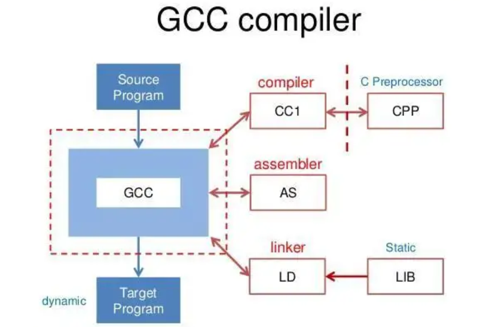
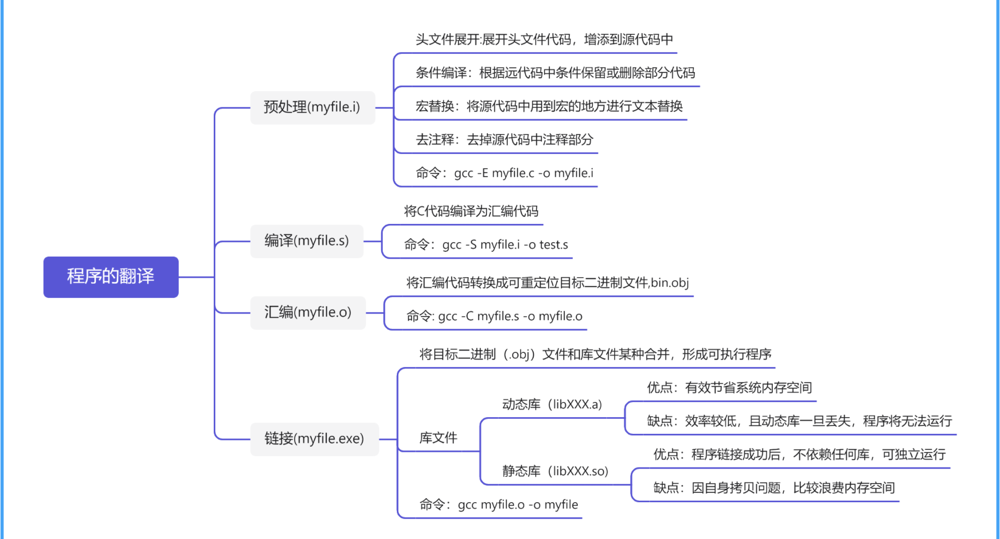
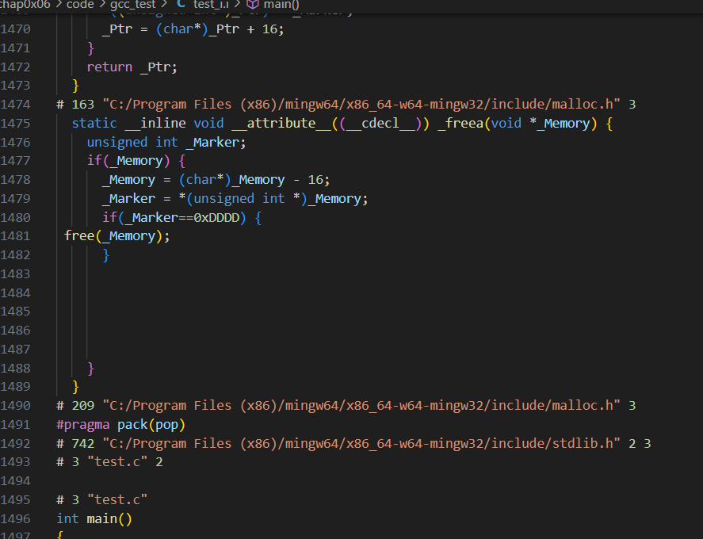
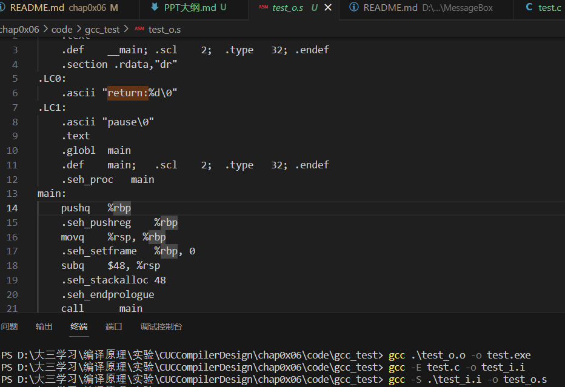
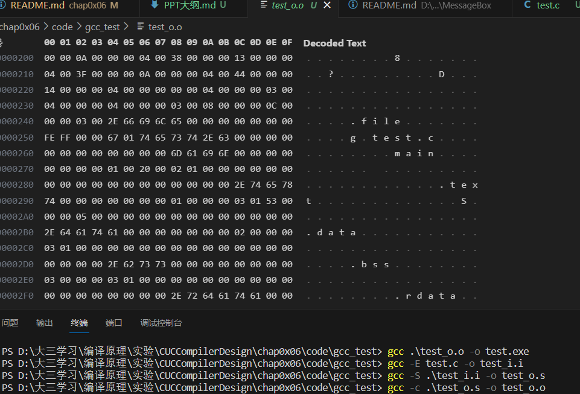
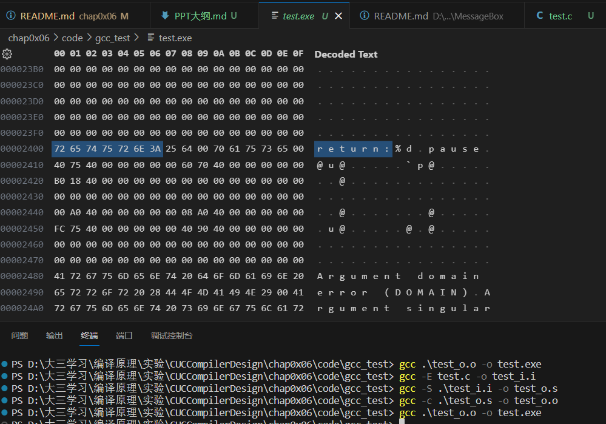

# 实验六
## 分析GCC编译器

- 汇报时间 2024.1.19
- 小组：李多扬小组
- 成员：李多扬 智于行 刘栩孜 孙田塍 储伟涛 张桓嘉

## 任务分工

## 内容

### 1. GCC编译器的概述

[GNU编译器（GCC, GNU Compiler Collection）](https://gcc.gnu.org/)是GNU工具链的关键组件，与GNU、Linux相关项目的标准编译器。它设计之初仅用来处理C语言的（也被称为GNU C编译器），紧接着扩展到C++、Objective-C/C++、Fortran、Java、Go等编程语言(如g++)。


### 2. GNU编译器（GCC）的编译过程

#### 2.1 从程序编译角度看GCC

GCC的编译工程可以分为四个步骤：

- 预处理（Pre-Processing）：使用CPP对C语言源程序进行预处理生成预处理.i文件，在该过程主要对源代码文件中的文件包含(include)、预编译语句(如宏定义define等)进行分析；
- 编译（Compiling）：调用CC1将预处理后的.i文件编译汇编语言.s文件，这个阶段主要是对预处理文件进行转换以生成机器语言的目标程序；
- 汇编（Assembling）：GCC调用AS对汇编语言.s文件进行汇编，生成目标文件.o；
- 链接（Linking）：GCC调用LD将各个模块的.o文件连接起来生成一个可执行程序文件，该过程将目标文件/库文件指派到可执行程序各自对应的位置。



#### 2.2 从文件角度看GCC

GCC编译过程中生成了许多不同种类与功能的文件：

|文件后缀|文件类型|文件内容|    
|:---|:---|:---|
|.c|C语言源程序|源代码文件|
|.h|C语言头文件|源代码文件|
|.i|预处理后的C语言源程序|源代码文件|
|.s|汇编语言源程序|源代码文件|
|.o/.obj|目标文件|二进制文件|
|.so/.dll|动态链接库|二进制文件|


#### 2.3 以C语言程序为例分析GCC编译过程



##### 2.3.1 c源代码

```c
//test.c
// 简单的整型变量操作与输出程序
#include <stdio.h>
#include <stdlib.h>
int main()
{

    int x = 1;
    for (int i = 0; i < 10; i++)
    {
        x = x + 1;
    }
    printf("return:%d", x);
    system("pause");
    return 0;
}
```

##### 2.3.2 词法分析（Lexical Analysis）

gcc中的词法分析主要发生在`预处理阶段(Preprocessing)`

首先，在这个阶段，预处理器会处理所有以井号（#）开头的指令，如#include和#define等。
处理宏定义，将代码中的宏替换为相应的内容。
展开头文件，将#include的头文件内容插入到代码中。
如果有条件编译指令（如#ifdef、#ifndef、#if等），根据条件进行代码的选择性包含或排除

- 对应步骤： 预处理（Preprocessing）。
- 任务： 展开头文件、宏替换、条件编译等。
- 命令： gcc -E source.c -o output.i
- 示例： gcc -E test.c -o test_i.i



##### 2.3.3 语法分析（Syntax Analysis）

将预处理后的源代码翻译成汇编语言。这个阶段产生的文件通常被命名为*.s（汇编代码）。

- 对应步骤： 编译（Compilation）。
- 任务： 将预处理后的源代码翻译成汇编代码。
- 命令： gcc -S output.i -o output.s
- 示例： gcc -S .\test_i.i -o test_o.s



##### 2.3.4 语义分析（Semantic Analysis）与 中间代码生成（Intermediate Code Generation）

汇编器将汇编代码翻译成机器语言，生成目标文件（通常是*.o或*.obj文件），其中包含了二进制代码和符号表信息。

- 对应步骤： 汇编（Assembly）。
- 任务： 将汇编代码翻译成目标机器码（二进制文件）。
- 命令： gcc -c output.s -o output.o
- 示例： gcc -c .\test_o.s -o test_o.o

- `gcc -fdump-tree-all  map.c`会生成大量中间代码



##### 2.3.5 代码优化（Code Optimization）

- 对应步骤： 在整个过程中的优化步骤，包括中间代码生成后和目标代码生成前的优化。
- 在GCC中的实现： GCC内部包含多个优化器，如Gimple、RTL优化器等。

##### 2.3.6 目标代码生成（Target Code Generation）

链接器将各个目标文件以及可能的库文件组合在一起，解决各种符号的引用关系。
解析全局变量和函数的引用，将它们关联到相应的地址。
最终生成可执行文件，其中包含了程序的二进制代码，以及各个部分在内存中的布局信息。

- 对应步骤： 链接（Linking）。
- 任务： 将编译后的目标文件和可能需要的库文件链接成可执行文件。
- 命令： gcc output.o -o output
- 示例： gcc .\test_o.o -o test.exe




#### 总结


- test.c->test.i->test.s->test.o->test.exe

- 从 c 语言或者 c++语言的高级代码，转化为预处理的结果文
件，之后再去头变为汇编语言程序，再然后转为二进制机器代码，
最后进行库的链接，最终得到可执行文件。


